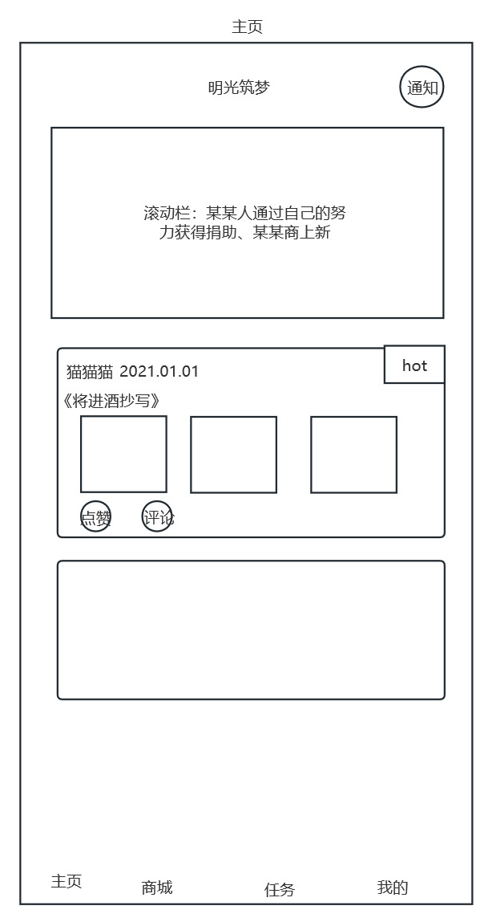
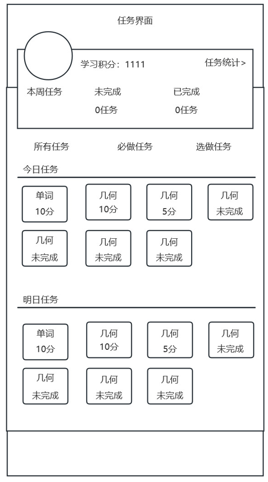
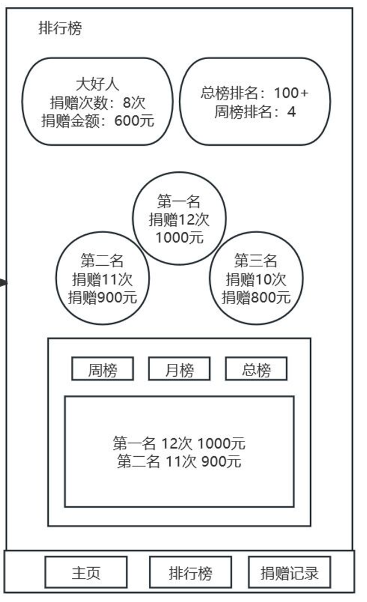
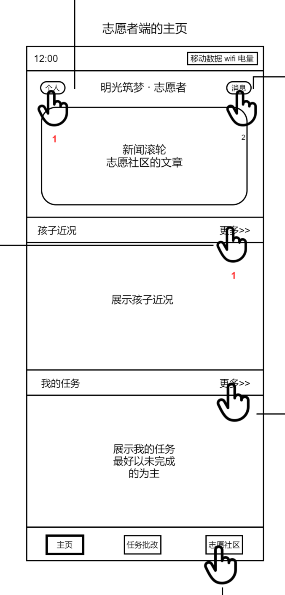

# Kid

## 1



### 获取hot

请求url

```
/kid/hot/reply
```

请求方法

```
GET
```

请求头

- `token: dklsjfkljasfklj`

响应体

```json
{
    "code": 200,
    "data": [
        {KidHotReplyDto},{}
    ],
    "msg": "success"
}
```


### 获取滚动栏recent

请求url

```
/kid/hot/recent
```

请求方法

```
GET
```

请求头

- `token: dklsjfkljasfklj`

响应体

```json
{
    "code": 200,
    "data": [
        {KidRecent},{}
    ],
    "msg": "success"
}
```


### 增加hot点赞

请求url

```
/kid/hot/reply/like
```

请求方法

```
POST
```

请求头

- `token: dklsjfkljasfklj`

请求体

```json
{
    replyId: "",
}
```

响应体

```json
{
    "code": 200,
    "msg": "success"
}
```


## 2


### 获取hot评论

请求url

```
/kid/hot/reply/{replyId}/comment
```

请求方法

```
GET
```

请求头

- `token: dklsjfkljasfklj`

响应体

```json
{
    "code": 200,
    "data": [
        {KidHotReplyCommentDto},
    ],
    "msg": "success"
}
```


### 增加hot评论

请求url

```
/kid/hot/reply/comment
```

请求方法

```
POST
```

请求头

- `token: dklsjfkljasfklj`

请求体

```json
{
    "replyId": "",
    "comment": ""
}
```

响应体

```json
{
    "code": 200,
    "msg": "success"
}
```


## 3




### 获取kid信息mission

请求url

```
/kid/info/mission
```

请求方法

```
GET
```

请求头

- `token: dklsjfkljasfklj`

响应体

```json
{
    "code": 200,
    "data": {
        totalPoint: 1,
        subMissionWaiting: 1,
        subMissionDone: 1,
        optMissionWaiting: 5,
        optMissionDone: 5,
        photo: "/A/B/C.jpg"
    },
    "msg": "success"
}
```


### 获取图片、视频文件

请求url

```
/media/download
```

请求方法

```
POST
```

请求头

- `token: dklsjfkljasfklj`
- `Content-Type: multipart/form-data`

响应体

使用 `multipart/form-data` 编码类型上传媒体文件（图片或视频）


### 获取指定date的mission列表

请求url

```
/kid/mission/date/{date}

/kid/mission/date/{2023-11-01}
```

请求方法

```
GET
```

请求头

- `token: dklsjfkljasfklj`

响应体

```json
{
    "code": 200,
    "data": [
        {
            missionId: "",
            tag: "",
            type: 1,
            point: 20,
            
            done: true,
            checked: true,
            score: 10,
        },
    ],
    "msg": "success"
}
```


## 4


### 获取mission的详情

请求url

```
/kid/mission/{id}
```

请求方法

```
GET
```

请求头

- `token: dklsjfkljasfklj`

响应体

```json
{
    "code": 200,
    "data": [
        {KidMissionDTO},
    ],
    "msg": "success"
}
```


### 获取mission的答题情况

请求url

```
/kid/reply/{missionId}
```

请求方法

```
GET
```

请求头

- `token: dklsjfkljasfklj`

响应体

```json
{
    "code": 200,
    "data": [
        {Reply},
    ],
    "msg": "success"
}
```


### 增加图片、视频文件

请求url

```
/media/upload
```

请求方法

```
POST
```

请求头

- `token: dklsjfkljasfklj`
- `Content-Type: multipart/form-data`

请求体

使用 `multipart/form-data` 编码类型上传媒体文件（图片或视频）

响应体

```json
{
    "code": 200,
    "data": {
        path: "/A/B/C.mp4"
    },
    "msg": "success"
}
```


### 增加mission的reply

请求url

```
/kid/reply
```

请求方法

```
POST
```

请求头

- `token: dklsjfkljasfklj`

请求体

```json
{
    "missionId": "",
    "replyMedia": "/A/B/C.mp4"
}
```

响应体

```json
{
    "code": 200,
    "msg": "success"
}
```


## 5


### 获取kid信息mall

请求url

```
/kid/info/mall
```

请求方法

```
GET
```

请求头

- `token: dklsjfkljasfklj`

响应体

```json
{
    "code": 200,
    "data": {
        mallPoint: 200
    },
    "msg": "success"
}
```


### 获取AwardType列表

请求url

```
/kid/award/type
```

请求方法

```
GET
```

请求头

- `token: dklsjfkljasfklj`

响应体

```json
{
    "code": 200,
    "data": [
        {KidAwardType},
    ],
    "msg": "success"
}
```


### 获取指定的Award列表

请求url

```
/kid/award
```

请求方法

```
POST
```

请求头

- `token: dklsjfkljasfklj`

请求体

```json
{
    "example": {
        "typeId": "",
        "name": ""
    },
    "pageNum": 0,
    "pageSize": 0
}
```

响应体

```json
{
    "code": 200,
    "data": [
        {
            "endRow": 0,
            "hasNextPage": true,
            "hasPreviousPage": true,
            "isFirstPage": true,
            "isLastPage": true,
            "list": [
                {KidAward},
            ],
            "navigateFirstPage": 0,
            "navigateLastPage": 0,
            "navigatePages": 0,
            "navigatepageNums": [
                0
            ],
            "nextPage": 0,
            "pageNum": 0,
            "pageSize": 0,
            "pages": 0,
            "prePage": 0,
            "size": 0,
            "startRow": 0,
            "total": 0
        }
    ],
    "msg": "success"
}
```


### 增加AwardLike（收藏Award

请求url

```
/kid/award/like
```

请求方法

```
POST
```

请求头

- `token: dklsjfkljasfklj`

请求体

```json
{
  "awardId": "",
}
```

响应体

```json
{
    "code": 200,
    "msg": "success"
}
```


### 增加AwardExchange（兑换Award

请求url

```
/kid/award/exchange
```

请求方法

```
POST
```

请求头

- `token: dklsjfkljasfklj`

请求体

```json
{
  "awardId": "",
}
```

响应体

```json
{
    "code": 200,
    "msg": "success"
}
```


## 6


### 获取AwardExchange

请求url

```
/kid/awardexchange
```

请求方法

```
GET
```

请求头

- `token: dklsjfkljasfklj`

请求体

```json
{
    "pageNum": 0,
    "pageSize": 0
}
```

响应体

```json
{
    "code": 200,
    "data": [
        {
            "endRow": 0,
            "hasNextPage": true,
            "hasPreviousPage": true,
            "isFirstPage": true,
            "isLastPage": true,
            "list": [
                {KidAwardExchangeDto},
            ],
            "navigateFirstPage": 0,
            "navigateLastPage": 0,
            "navigatePages": 0,
            "navigatepageNums": [
                0
            ],
            "nextPage": 0,
            "pageNum": 0,
            "pageSize": 0,
            "pages": 0,
            "prePage": 0,
            "size": 0,
            "startRow": 0,
            "total": 0
        }
    ],
    "msg": "success"
}
```


## 7


### 获取AwardLike

请求url

```
/kid/awardLike
```

请求方法

```
GET
```

请求头

- `token: dklsjfkljasfklj`

请求体

```json
{
    "pageNum": 0,
    "pageSize": 0
}
```

响应体

```json
{
    "code": 200,
    "data": [
        {
            "endRow": 0,
            "hasNextPage": true,
            "hasPreviousPage": true,
            "isFirstPage": true,
            "isLastPage": true,
            "list": [
                {KidAward},
            ],
            "navigateFirstPage": 0,
            "navigateLastPage": 0,
            "navigatePages": 0,
            "navigatepageNums": [
                0
            ],
            "nextPage": 0,
            "pageNum": 0,
            "pageSize": 0,
            "pages": 0,
            "prePage": 0,
            "size": 0,
            "startRow": 0,
            "total": 0
        }
    ],
    "msg": "success"
}
```


## 8


### 发送信息

请求url

```
/chat/send
```

请求方法

```
POST
```

请求头

- `token: dklsjfkljasfklj`

请求体

```json
{
    "content": "",
    "toId": "",
    "toType": 0
}
```


### 开始获取信息

请求url

```
/chat/receive
```

请求方法

```
GET
```

请求头

- `token: dklsjfkljasfklj`

响应体

```json
{
    "content": "",
    "time": "2023-11-02 14:23",
    "fromId": "",
    "fromType": 1
}
```


## 9


### 获取kid信息me

请求url

```
/kid/info/me
```

请求方法

```
GET
```

请求头

- `token: dklsjfkljasfklj`

响应体

```json
{
    "code": 200,
    "data": {KidDTO},
    "msg": "success"
}
```


### 获取图片、视频文件


## 10


### 获取kid信息recent

请求url

```
/kid/info/recent
```

请求方法

```
GET
```

请求头

- `token: dklsjfkljasfklj`

响应体

```json
{
    "code": 200,
    "data": {KidRecent},
    "msg": "success"
}
```


### 获取kid信息mission


### 获取图片、视频文件


# Donor

## 1


### 获取系统概要

请求url

```
/donor/hot/des
```

请求方法

```
GET
```

请求头

- `token: dklsjfkljasfklj`

响应体

```json
{
    "code": 200,
    "data": {
        "donationAmount": 20000,
        "helprdAmount": 200
    },
    "msg": "success"
}
```


### 获取某kid信息recent

请求url

```
/donor/kid/recent
```

请求方法

```
GET
```

请求头

- `token: dklsjfkljasfklj`

响应体

```json
{
    "code": 200,
    "data": {
        "name": "",
        "photo": "/A/B/C.jpg",
        "recent": ""
    },
    "msg": "success"
}
```


## 2


### 获取KidType

请求url

```
/donor/kidtype
```

请求方法

```
GET
```

请求头

- `token: dklsjfkljasfklj`

响应体

```json
{
    "code": 200,
    "data": [
        {kidType},
    ],
    "msg": "success"
}
```


### 获取指定的Kid列表

请求url

```
/donor/kid
```

请求方法

```
POST
```

请求头

- `token: dklsjfkljasfklj`

请求体

```json
{
    "example": {
        "typeId": "",
        "name": ""
    },
    "pageNum": 0,
    "pageSize": 0
}
```

响应体

```json
{
    "code": 200,
    "data": [
        {
            "endRow": 0,
            "hasNextPage": true,
            "hasPreviousPage": true,
            "isFirstPage": true,
            "isLastPage": true,
            "list": [
                {KidDTO},
            ],
            "navigateFirstPage": 0,
            "navigateLastPage": 0,
            "navigatePages": 0,
            "navigatepageNums": [
                0
            ],
            "nextPage": 0,
            "pageNum": 0,
            "pageSize": 0,
            "pages": 0,
            "prePage": 0,
            "size": 0,
            "startRow": 0,
            "total": 0
        }
    ],
    "msg": "success"
}
```


## 3


### 获取kid信息show

请求url

```
/donor/kid/show
```

请求方法

```
GET
```

请求头

- `token: dklsjfkljasfklj`

响应体

```json
{
    "code": 200,
    "data": {KidDTO},
    "msg": "success"
}
```


### 获取图片、视频文件


## 4


### 增加善款捐助

请求url

```
/donor/kiddonation
```

请求方法

```
POST
```

请求头

- `token: dklsjfkljasfklj`

请求体

```json
{
    kidId: "",
    amount: "",
    time: ""
}
```

响应体

```json
{
    "code": 200,
    "msg": "success"
}
```


### 增加物品捐助

请求url

```
/donor/kidthing
```

请求方法

```
POST
```

请求头

- `token: dklsjfkljasfklj`

请求体

```json
{
    kidId: "",
    thing: "",
    time: ""
}
```

响应体

```json
{
    "code": 200,
    "msg": "success"
}
```


## 5


### 获取ProjectType

请求url

```
/donor/projecttype
```

请求方法

```
GET
```

请求头

- `token: dklsjfkljasfklj`

响应体

```json
{
    "code": 200,
    "data": [
        {projecttype},
    ],
    "msg": "success"
}
```


### 获取指定的Project列表

请求url

```
/donor/project
```

请求方法

```
POST
```

请求头

- `token: dklsjfkljasfklj`

请求体

```json
{
    "example": {
        "typeId": "",
        "name": ""
    },
    "pageNum": 0,
    "pageSize": 0
}
```

响应体

```json
{
    "code": 200,
    "data": [
        {
            "endRow": 0,
            "hasNextPage": true,
            "hasPreviousPage": true,
            "isFirstPage": true,
            "isLastPage": true,
            "list": [
                {ProjectDTO},
            ],
            "navigateFirstPage": 0,
            "navigateLastPage": 0,
            "navigatePages": 0,
            "navigatepageNums": [
                0
            ],
            "nextPage": 0,
            "pageNum": 0,
            "pageSize": 0,
            "pages": 0,
            "prePage": 0,
            "size": 0,
            "startRow": 0,
            "total": 0
        }
    ],
    "msg": "success"
}
```


## 6


### 获取Project信息

请求url

```
/donor/project/show
```

请求方法

```
GET
```

请求头

- `token: dklsjfkljasfklj`

响应体

```json
{
    "code": 200,
    "data": {ProjectDTO},
    "msg": "success"
}
```


### 获取图片、视频文件


## 7


### 增加项目捐助

请求url

```
/donor/projectdonation
```

请求方法

```
POST
```

请求头

- `token: dklsjfkljasfklj`

请求体

```json
{
    projectId: "",
    amount: "",
    time: ""
}
```

响应体

```json
{
    "code": 200,
    "msg": "success"
}
```


## 8


### 获取Donation概要

请求url

```
/donor/donationdes
```

请求方法

```
GET
```

请求头

- `token: dklsjfkljasfklj`

响应体

```json
{
    "code": 200,
    "data": {
        "times": 10,
        "amount": 20000,
        "rank": 50
    },
    "msg": "success"
}
```


### 获取Donation列表

请求url

```
/donor/donation
```

请求方法

```
GET
```

请求头

- `token: dklsjfkljasfklj`

响应体

```json
{
    "code": 200,
    "data": [
        {donationDTO}
    ],
    "msg": "success"
}
```


### 获取kid信息recent

请求url

```
/donor/kid/recent
```

请求方法

```
GET
```

请求头

- `token: dklsjfkljasfklj`

响应体

```json
{
    "code": 200,
    "data": {
        "name": "",
        "photo": "/A/B/C.jpg",
        "recent": ""
    },
    "msg": "success"
}
```


## 9



### 获取Donation概要


### 获取Donation概要总/月/日排行

请求url

```
/donor/donationdes/allrank/{num}
/donor/donationdes/monthrank/{num}
/donor/donationdes/weekrank/{num}
```

请求方法

```
GET
```

请求头

- `token: dklsjfkljasfklj`

响应体

```json
{
    "code": 200,
    "data": [
        {
            "times": 10,
            "amount": 20000,
            "rank": 50
        },
    ],
    "msg": "success"
}
```


# Volunteer


## 1



#### 获取孩子最近得到的捐助

请求url

    /volunteer/kidhelp

请求方法

    GET

请求头

·`token`:jdodojdjk

响应体

```json
{
"code":200
data:[
    DonationDTO
]   
"msg": "sucess" 
}
```


#### 获取志愿者对应的孩子信息

请求url

```
/volunteer/kidinfo
```

请求方法

```
GET
```

请求头

·`token`:jdodojdjk

响应体

```json
{
"code":200
data:[
    {Kid}
]   
"msg": "sucess" 
}
```

#### 获取志愿者对应的孩子照片

请求url

```
/volunteer/kidpic
```

请求方法

```
GET
```

请求头

·`token`:jdodojdjk

请求体：

```json
{
    pic:"A/B/C.png(jpg)"
}
```

响应体

```
//kidpic文件
```


#### 获取我的任务

请求url

```
/volunteer/mission
```

请求方法

```
GET
```

请求头

·`token`:jdodojdjk

响应体

```json
{
"code":200
data:[
    KidMissionDTO
]   
"msg": "sucess" 
}
```


#### 获取滚动的文章

请求url

```
/volunteer/article
```

请求方法

```
GET
```

请求头

·`token`:jdodojdjk

响应体

```json
{
"code":200
data:[
    ArticleDTO
]   
"msg": "sucess" 
}
```


## 2


#### 获取孩子信息

请求url

```
/volunteer/kid
```

请求方法

```
GET
```

请求头

·`token`: jdodojdjk

响应体

```json
{
"code":200
data:[
    {KidDTO},
]   
"msg": "sucess" 
}
```


#### 获取孩子们的头像

分开发送请求，然后向上面一样发送请求就行了

## 3

#### 


#### 获取志愿者对应的孩子信息

（与上面的获取孩子信息相同）


#### 获取志愿者对应的孩子照片

（与上面的获取孩子照片相同）


#### 获取孩子最近得到的捐助

请求url

```
/volunteer/kidhelp
```

请求方法

```
GET
```

请求头

·`token`:jdodojdjk

响应体

```json
{
"code":200
data:[
    DonationDTO
]   
"msg": "sucess" 
}
```


#### 获取孩子对应的任务

请求url

```
/volunteer/kidmission
```

请求方法

```
GET
```

请求头

·`token`:jdodojdjk

响应体

```json
{
"code":200
data:[
    {MissionDTO},
]   
"msg": "sucess" 
}
```


## 4


#### 获取志愿者信息

请求url

```
/volunteer/info
```

请求方法

```
GET
```

请求头

·`token`: jdodojdjk

响应体

```json
{
"code":200
data:[
    Volunteer
]   
"msg": "sucess" 
}
```


#### 获取志愿者的头像图片

请求url

```
/volunteer/pic
```

请求方法

```
GET
```

请求头

·`token`: jdodojdjk

请求体：

```json
{
    pic:"A/B/C.png(jpg)"
}
```

响应体

    //志愿者头像图片


## 5


#### 获取孩子信息

（与上面获取孩子信息接口相同）


#### 获取孩子们的照片

分开发送请求，然后向上面一样发送请求就行了


## 6


## 7


#### 获取任务列表

请求url

```
/volunteer/missionlist
```

请求方法

```
GET
```

请求头

·`token`: jdodojdjk

请求体

```json
{
    missionName: ""
}
```

响应体

```json
{
"code":200
data:[
    {MissionDTO},
]   
"msg": "sucess" 
}
```


## 8


#### 获取任务的完成情况

请求url

```
/volunteer/mission/allkid/detail
```

请求方法

```
GET
```

请求头

·`token`: jdodojdjk

请求体

```json
{
    missionId: ""
}
```

响应体

```json
{
"code":200
data:[
    {MissionKidDTO},
]   
"msg": "sucess" 
}
```


#### 获取上图中的孩子的头像照片

（同上面获取孩子头像照片一样）


## 9


#### 获取具体孩子上传媒体所存的地址

请求url

```
/volunteer/mission/kid/detail
```

请求方法

```
GET
```

请求头

·`token`: jdodojdjk

请求体

```json
{
    missionId: "",
    kidid: ""
}
```

响应体

```json
{
  {reply}，
} 
```


#### 获取具体孩子上传媒体

请求url

```
/volunteer/mission/kid/detail/pic
```

请求方法

```
GET
```

请求头

·`token`: jdodojdjk

请求体

```json
{
  picurl: ""
}
```

响应体

```json
//媒体文件
```


#### 存入志愿者给具体孩子完成任务的打分

请求url

```
/volunteer/mission/inputscore
```

请求方法

```
POST
```

请求头

·`token`: jdodojdjk

请求体

```json
{
  missionId: ""，
  kidId: "",
  score: ""
}
```

响应体

```json
无
```


## 10


#### 获取文章

请求url

```
/volunteer/articlelist
```

请求方法

```
GET
```

请求头

·`token`: jdodojdjk

响应体

```json
{
"code":200
data:[
    {ArticleDTO},
]   
"msg": "sucess" 
}
```


#### 获取文章中的图片们

请求url

```
/volunteer/articlelist/pic
```

请求头

·`token`: jdodojdjk

请求方法

```
GET
```

请求体

```json
{
articlepic: ""
}
```

响应体

    //文章图片


## 11


#### 获取被搜索的文章

请求url

```
/volunteer/article/search
```

请求头

·`token`: jdodojdjk

请求方法

```
GET
```

请求体

```json
{
articleName: ""
}
```

响应体

```json
{
"code":200
data:[
    {ArticleDTO},
]   
"msg": "sucess" 
}
```


## 12


#### 获取文章详情

请求url

```
/volunteer/article/detail
```

请求头

·`token`: jdodojdjk

请求方法

```
GET
```

请求体

```json
{
articleId: ""
}
```

响应体

```json
{
"code":200
data:[
    {ArticleDTO},
]   
"msg": "sucess" 
}
```


#### 获取文章作者头像

请求url

```
/volunteer/article/pic
```

请求头

·`token`: jdodojdjk

请求方法

```
GET
```

请求体

```json
{
articlePicUrl: ""
}
```

响应体

    //作者头像图片


#### 获取文章评论者头像

请求url

```
/volunteer/article/commentpic
```

请求头

·`token`: jdodojdjk

请求方法

```
GET
```

请求体

```json
{
commentPicUrl: ""
}
```

响应体

```
//评论者头像图片
```


## 13


#### 获取志愿者收藏的文章

请求url

```
/volunteer/article/collected
```

请求头

·`token`: jdodojdjk

请求方法

```
GET
```

响应体

```json
{
"code":200
data:[
    {ArticleDTO},
]   
"msg": "sucess" 
}
```


